# Devnology **Datomic**

---

---

---

# Topics

Part I

* Introduction
* Deconstructing the Database
* Datomic Architecture
* NoSQL, NewSQL and Datomic

Part II

* Datalog Crash Course
* Lab Exercises

---

---

# Rich Hickey

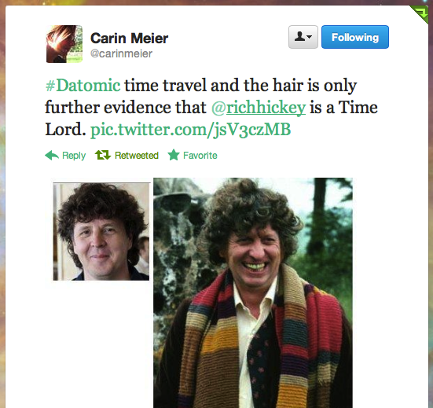

---

# Complexity

Rich Hickey, at [Strangeloop 2011](http://www.infoq.com/presentations/Simple-Made-Easy)

.notes: Complected, braided together. Design means: taking things apart.

---

# Complected

## com·plect·ed

**adjective** \kəm-ˈplek-təd\

## Usage Discussion of COMPLECTED

Not an error, nor a dialectal term, nor nonstandard—all of which it has been labeled—complected still manages to raise hackles. It is an Americanism, apparently nonexistent in British English. Its currency in American English is attested as early as 1806 (by Meriwether Lewis) and it appears in the works of such notable American writers as Mark Twain, O. Henry, James Whitcomb Riley, and William Faulkner. Complexioned, recommended by handbooks, has less use than complected. Literary use, old and new, slightly favors complected.

## Origin of COMPLECTED

irregular from complexion

First Known Use: 1785

---

# Deconstruction

Jacques Derrida (1930-2004)

.notes: to overturn all binary oppositions (of metaphysics)

.notes: one of the two terms is dominant

.notes: deconstruction is to overturn the hierarchy, not to synthesize, but to mark their difference

.notes: Deconstruction also means taking things apart. The term is a contamination of 'destruction' and 'construction' and aims to take things apart but also to put things together to provide new meaning.

---

# Deconstruction

(not in metaphysics, but in IT)

relations | objects => facts

place | time => values

client | server => peers

reads | writes => reaction

---

# Deconstructing the Database

* Information Model
* State Model
* Coordination Model
* Distribution Model

---

# Deconstructing the Information Model

* Traditional: relations vs. objects, impedance mismatch

* Datomic: facts, EAVT, Datoms - combined with a declarative, relational query language to store and retrieve those facts (no SQL by the way) 

---

# Deconstructing the State Model

* Traditional: update in place, contention, "the basis problem"

* Datomic: Accretion of immutable facts, the database as an expanding value, otherwise: [excision](http://blog.datomic.com/2013/05/excision.html)

.notes: quite reasonable in a time where storage is expensive, but that is not the case anymore. Over there, a place.

---

# Deconstructing the Coordination Model

* Traditional: heavy coordination for reads and writes, need to poll for novelty

* Datomic: splits "perception" (reads) and "process" (writes), reactive - not polling

--- 

# Deconstructing the Distribution Model

* Traditional: Client-server, partitions between service providers and service requesters

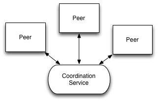

* Datomic: Peers and Storage, and Transactors too, empower applications by coordinating change and storage

---

# Deconstructing the Database

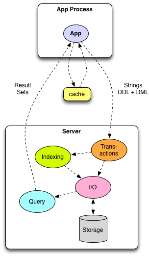

Source: Rich Hickey, at [GOTO 2012](http://www.infoq.com/presentations/Datomic)

.notes: Basis problem with client-server, "over there"

---

# Deconstructing the Database

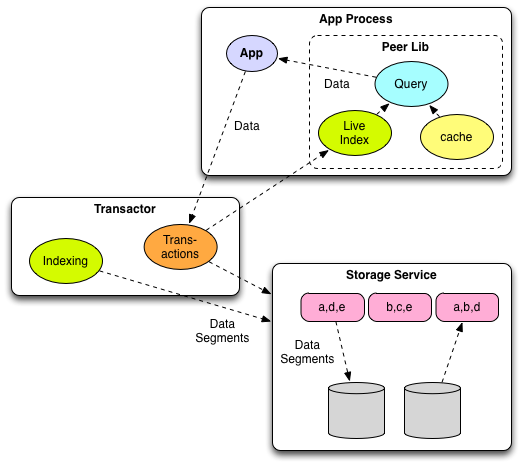

Source: Rich Hickey, at [GOTO 2012](http://www.infoq.com/presentations/Datomic)

.notes: Basis problem with client-server, "over there"

---

# Datomic Architecture

---

# Datomic Architecture

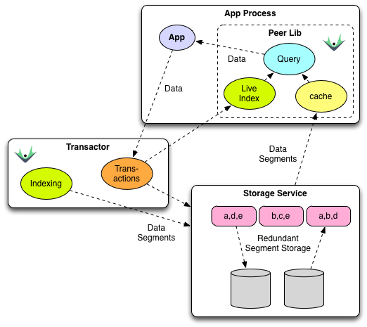

---

# Storage Services

---

# Indexing

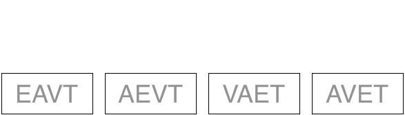

---

# Indexing

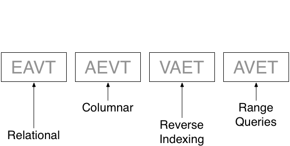

---

# Indexing

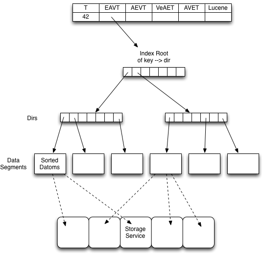

---

# NoSQL, NewSQL and Datomic

---

# Datomic vs. No/New/SQL

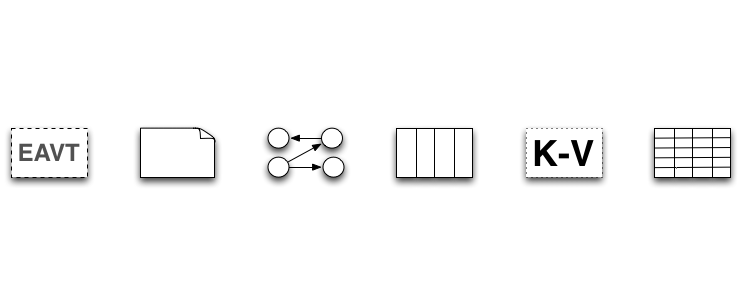

---

# Datomic vs. No/New/SQL

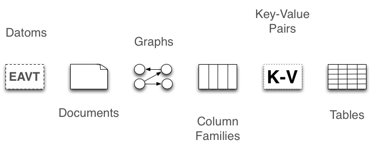

---

# Shimmer (SNL)

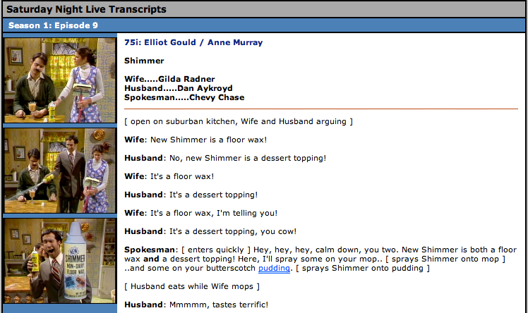

http://snltranscripts.jt.org/75/75ishimmer.phtml

---

# Check all that apply...

&#x2752; Document Store

&#x2752; Graph Database

&#x2752; Column-Family Store

&#x2752; Key-Value Store

&#x2752; Relational Database

---

# Datomic vs. Document Stores

 

* Documents are comparable to entities with attributes and values
* But: Datoms are not JSON Documents
* Datoms, not documents, are the unit of storage

---

# Datomic vs. Graph Databases

 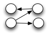

* Strong similaries, e.g. [Back To The Future with Datomic](http://architects.dzone.com/articles/back-future-datomic)
* And [blueprints-datomic-graph](https://github.com/datablend/blueprints/tree/master/blueprints-datomic-graph) implements [Blueprints API](https://github.com/tinkerpop/blueprints/wiki)
* But: Neo4j has reified edges, Datomic has reified transactions

---

# Datomic vs. Column-Family Stores

 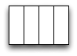

* Datomic AEVT indexing ~ a column store
* Sparse, irregular data, single and multi-valued attributes
* But: in Datomic, it's more straightforward to work with entities

---

# Datomic vs. Key-Value Stores

 

* Datomic uses DynamoDB KV-store for storage
* Datomic uses Memcached for caching
* But: Datomic has information model, adds leverage with query, transactions and consistency

.notes: SH on Google Groups: "(1) Datomic's distributed caching eliminates the common use case for running Redis alongside a persistent store, and (2) Redis does not seem to encourage conditional put, which is one straightforward way to map to Datomic's coordination requirements. Not carved in stone, though"

---

# Datoms vs. (New) Relational Databases

 

* Transactional serial writes, using just a single writer
* But, Datomic = no rectangles = no structural rigidity
* And: not only focus on TP, also on analytics

.notes: VoltDB write throughput = 40-50x faster than traditional databases

---

# Agility

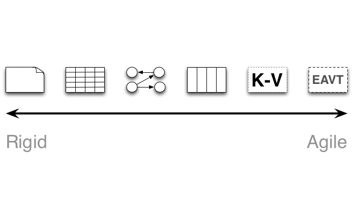

Adapted from: Stuart Halloway, from "Day of Datomic" training

---

# References

[Datomic development resources](http://docs.datomic.com)

API for [Java](http://docs.datomic.com/javadoc/index.html), [Clojure](http://docs.datomic.com/clojure/index.html) and [REST](http://docs.datomic.com/rest.html)

Datomic forum at [Google Groups](https://groups.google.com/forum/?fromgroups#!forum/datomic)

Datomic [the blog](http://blog.datomic.com)

Presentations about Datomic: [The Design of Datomic](http://www.infoq.com/presentations/The-Design-of-Datomic) [Writing Datomic in Clojure](http://www.infoq.com/presentations/Datomic), [The Database as a Value](http://www.infoq.com/presentations/Datomic-Database-Value), [Deconstructing the Database](http://www.infoq.com/presentations/Deconstructing-Database)

Use case: analyze code using [codeq](http://blog.datomic.com/2012/10/codeq.html)

---

# Crash Course Datalog

---

# Datalog in 6 minutes

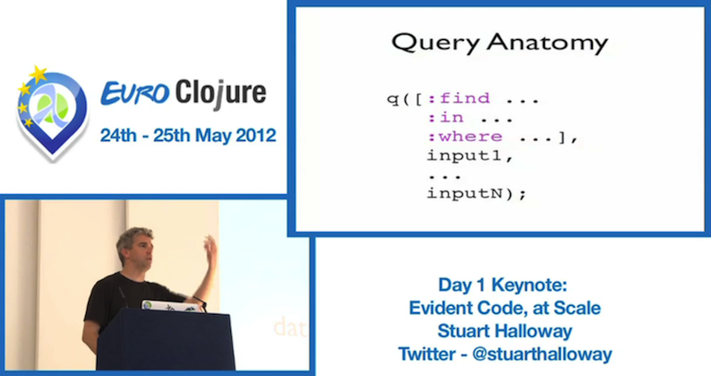

Source: Stuart Halloway, at [EuroClojure](http://vimeo.com/45136215) @ 24:30

See also [this](http://www.datomic.com/videos.html#query) tutorial

---

# Query Anatomy

Clojure

	!clojure
	(q ('[:find ...
	      :in ...
	      :where ...]
	      input1
	      ...
	      inputN))
	
Java

	!java
	q( "[:find ...
	     :in ...
	     :where ...]",
	     input1,
	     ...,
	     inputN);

.notes: :where - constraints, :in - inputs, :find - variables to return
	
---

# Variables and Constants

Variables

* ?customer
* ?product
* ?orderId
* ?email
	
Constants

* 42
* :email
* "john"
* :order/id
* \#instant "2012-02-29"

---

# Data Pattern: E-A-V

	!html
	-------------------------------------------
	| entity | attribute | value              |
	-------------------------------------------
	| 42     | :email	  | jdoe@example.com  |
	| 43     | :email     | jane@example.com  |
	| 42     | :orders    | 107               |
	| 42     | :orders    | 141               |
	-------------------------------------------

Constrain the results returned, binds variables

	!clojure
	[?customer :email ?email]
-> jdoe@example.com, jane@example.com

	!clojure
	[42 :email ?email]
-> jdoe@example.com
	
---

# Data Pattern: E-A-V

	!html
	-------------------------------------------
	| entity | attribute | value              |
	-------------------------------------------
	| 42     | :email	  | jdoe@example.com  |
	| 43     | :email     | jane@example.com  |
	| 42     | :orders    | 107               |
	| 42     | :orders    | 141               |
	-------------------------------------------

What attributes does customer 42 have?

	!clojure
	[42 ?attribute]
-> :email, :orders

What attributes and values does customer 42 have?

	!clojure
	[42 ?attribute ?value]
-> :email - jdoe@example.com, :orders - 107, 141

--- 

# Where Clause

Where to put the data pattern?

	!clojure
	[:find ?customer
	 :where [?customer :email]]
	
Implicit Join

	!clojure
	[:find ?customer
	 :where [?customer :email]
	        [?customer :orders]]

---

# Input(s)

	!java
	import static datomic.Peer.q;
	
	q("[:find ?customer :in $ :where [?customer :id] [?customer :orders]]", 
	    db);
	
Find using $database and ?email:

	!java
	q("[:find ?customer" +
	   ":in $ ?email " +
	   ":where [?customer :email ?email]]",
	    db, "jdoe@example.com");
	
--- 

# DB and non-DB resources

	!java
	q("[:find ?a ?v :in $ :where [$ ?a ?v]]", 
	  System.getProperties());

---

# Predicates

Functional constraints that can appear in a :where clause

	!clojure
	[(< 50.0 ?price)]
	
Find the expensive items

	!clojure
	[:find ?item
	 :where [?item :item/price ?price]
	        [(< 50.0 ?price)]]
	
---

# Aggregates

The syntax is incorporated in the :find clause:

    !clojure
    [:find ?a (min ?b) (max ?b) ?c (sample 12 ?d) :where ...]

The list expressions are aggregate expressions. 
Query variables not in aggregate expressions will group the results and appear intact in the result. 

The included aggregation functions are:

* min, max
* count, count-distinct
* sum, avg, median
* variance, stddev
* rand
	
---

# Functions

	!clojure
	[(shipping ?zip ?weight) ?cost]
	
Call functions by binding inputs:

	!clojure
	[:find ?customer ?product
	 :where [?customer :shipAddress ?address]
	        [?address :zip ?zip]
	        [?product :product/weight ?weight]
	        [?product :product/price ?price]
	        [(Shipping/estimate ?zip ?weight) ?shipCost]
	        [(<= ?price ?shipCost)]]
	
Or: find me the customer/product combinations where the shipping cost dominates the product cost.

---

# Lab Exercises

---

# Soccer Players

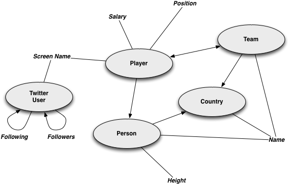

https://github.com/mamersfo/datomic-intro-java
